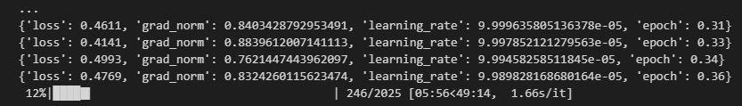
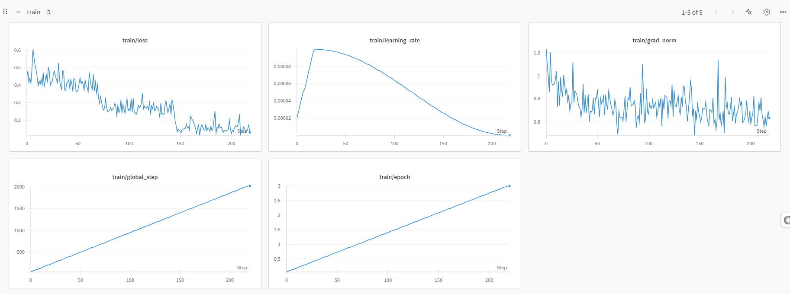
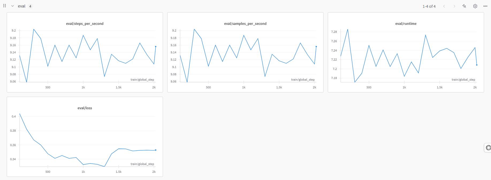

📌 **Note**: This notebook is based on code from [Abu Bakr Soliman](https://colab.research.google.com/drive/1tf6pjAwz2ZJdv1IcP6YcIrLFa4iW6svT?usp=sharing#scrollTo=xOpAbHLSioBz) shown in [LLMs Fine-Tuning](https://www.youtube.com/watch?v=S9VHQhC3HPc&t=109s&ab_channel=AbuBakrSoliman). I’ve adapted and extended it to fine-tune the Qwen2.5-1.5B-Instruct model on a custom dataset.
and [Unsloth](https://github.com/unslothai/unsloth) [Llama 3.1 8B Notebook](https://colab.research.google.com/github/unslothai/notebooks/blob/main/nb/Llama3.1_(8B)-Alpaca.ipynb)

# Instruction Tuning with LoRA on Qwen and LLaMA Models

This project demonstrates how to fine-tune [Qwen/Qwen2.5-1.5B-Instruct](https://huggingface.co/Qwen/Qwen2.5-1.5B-Instruct) and [Llama-3.1-8B](https://huggingface.co/meta-llama/Llama-3.1-8B) using Low-Rank Adaptation (LoRA) on a custom instruction-style dataset. It includes:
- Data preprocessing  
- Model setup  
- Training with [Unsloth](https://github.com/unslothai/unsloth) for fast and memory-efficient fine-tuning  
- Evaluation and inference using [vLLM](https://github.com/vllm-project/vllm) for optimized deployment  

---

## 🧠 Models Fine-Tuned

| Model                     | Notebook                                           | Base Model Link                                         |
|--------------------------|----------------------------------------------------|---------------------------------------------------------|
| Qwen2.5-1.5B-Instruct     | `Qwen2.5-1.5B-Instruct-Finetuning.ipynb`           | [Qwen2.5-1.5B-Instruct](https://huggingface.co/Qwen/Qwen2.5-1.5B-Instruct) |
| Llama-3.1-8B       | `Llama-3.1-8B-FineTuning.ipynb`             | [Llama-3.1-8B](https://huggingface.co/meta-llama/Llama-3.1-8B) |

---

## Requirements

- Python 3.10+
- Colab with GPU (A100 recommended), this was done on NVIDIA A100 40GB  
  
- `transformers`, `unsloth`, `peft`, `datasets`, `trl`, `vllm`

---

## Images
- Training 
  
- Testing 
  
## Usage

Open any of the notebooks in Colab and follow the instructions to mount your Google Drive, set up your dataset, and begin training.

---

## 📚 Credits

Most of the original code structure and training setup were adapted from the following:
- From [Abu Bakr Soliman](https://colab.research.google.com/drive/1tf6pjAwz2ZJdv1IcP6YcIrLFa4iW6svT?usp=sharing#scrollTo=xOpAbHLSioBz) as demonstrated in [LLMs Fine-Tuning](https://www.youtube.com/watch?v=S9VHQhC3HPc&t=109s&ab_channel=AbuBakrSoliman)
- From Adam Lucek as demonstrated in [Quantizing LLMs](https://www.youtube.com/watch?v=3EDI4akymhA&ab_channel=AdamLucek)
- [Unsloth](https://github.com/unslothai/unsloth) [Llama 3.1 8B Notebook](https://colab.research.google.com/github/unslothai/notebooks/blob/main/nb/Llama3.1_(8B)-Alpaca.ipynb)
- [vLLM](https://github.com/vllm-project/vllm)
- [LLaMA-Factory](https://github.com/hiyouga/LLaMA-Factory/tree/main)
- Add inference examples and LoRA-specific training logic